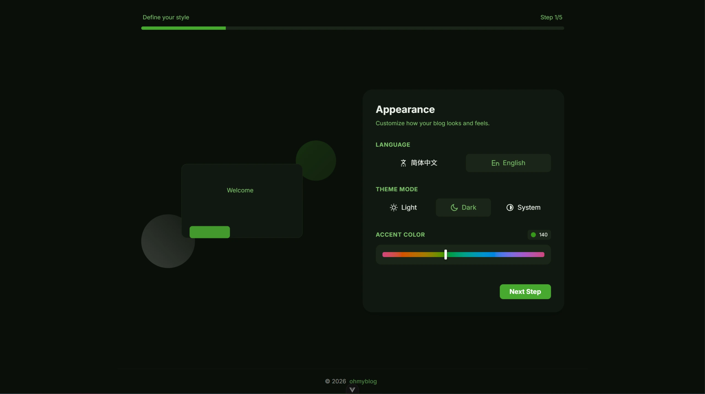
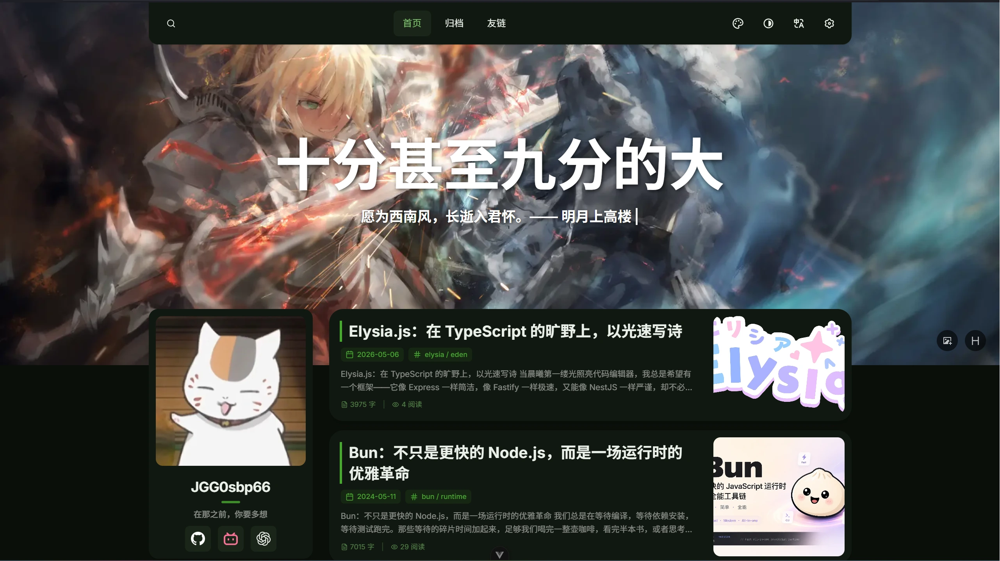
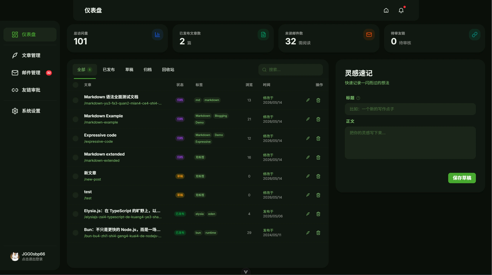

<div align="center">
	<h1>ohmyblog</h1>
	<p>一个现代化、可自部署的全栈博客系统（前台 + 管理后台 + API）。</p>
	<p>
		
		
		
		
	</p>
</div>

## 🖼️ 预览

<p align="center">
	
</p>
<p align="center">
	
</p>
<p align="center">
	
</p>

## ✨ 功能特性

### 🎨 设计与界面

- [x] 主题模式：浅色 / 深色 / 跟随系统
- [x] 品牌色相自定义（Hue 0-360）
- [x] 多语言切换（zh-CN / en-US）
- [x] 响应式布局，移动端友好

### 🔍 内容与搜索

- [x] 前台文章列表分页 + 关键词搜索（标题 / 正文）
- [x] 归档时间轴数据接口（全量轻量列表）
- [x] 文章详情使用 Markdown 输出（contentMarkdown）
- [x] 标签与 slug 友好链接

### 📝 内容创作与管理

- [x] 草稿一键创建 + 编辑器自动保存
- [x] 标题自动生成 slug，支持手动覆盖
- [x] 状态流转：草稿 / 发布 / 归档 / 回收站
- [x] 管理后台文章列表分页 + 各状态统计
- [x] 摘要、封面图、行内图完整支持

### 🔗 友链生态

- [x] 前台友链展示 + 申请提交
- [x] 管理后台审核通过 / 拒绝 / 更新 / 删除
- [x] 待审核数量统计（仪表盘）

### 📧 邮件与账号

- [x] 登录 / 注册 / 登出 / 账号信息更新
- [x] 忘记密码验证码 + 重置密码
- [x] SMTP 配置、连接测试、发送测试邮件
- [x] 邮件日志列表、未读统计与预览

### ⚙️ 站点配置

- [x] 站点标题 / 图标 / 页脚 / 备案 / 页脚链接
- [x] 个人信息：头像 / 简介 / 社交链接
- [x] 首页 Hero 图与标题 / 副标题配置

### 🖼️ 资源与上传

- [x] 网站图标 / 管理员头像 / 社交图标上传
- [x] 首页横幅 / 文章封面 / 文章行内图上传
- [x] 上传后自动处理并返回可访问 URL

### 🛠 技术特性

- [x] Eden Treaty 前后端类型共享
- [x] OpenAPI 文档 + 健康检查
- [x] /api/uploads 静态资源访问

## 🧰 技术栈

- 前端：Vue 3、Vite、Tailwind CSS 4、Pinia、Vue Router、Vue I18n
- 后端：Bun、Elysia、Drizzle ORM、SQLite、Zod

## 🚀 快速开始

### 📦 安装依赖

```bash
# 后端
cd ohmyblog-backend
bun install

# 前端
cd ../ohmyblog-frontend
bun install
```

### ▶️ 启动开发

```bash
# 启动后端（默认 3000）
cd ohmyblog-backend
bun run dev

# 启动前端（默认 5173）
cd ../ohmyblog-frontend
bun run dev
```

### 🔗 访问地址

- 前台：<http://localhost:5173>
- OpenAPI：<http://localhost:3000/openapi>（仅开发环境）

## 🧱 项目结构

```text
ohmyblog/
├── img/                 # README 预览图
├── ohmyblog-backend/    # 后端 API 服务
└── ohmyblog-frontend/   # 前端 Web 应用
```

## 📚 文档

- [前端文档](./ohmyblog-frontend/README.md)
- [后端文档](./ohmyblog-backend/README.md)

## 📄 许可证

本项目基于 MIT 许可证，详见 [LICENSE](./LICENSE)。
