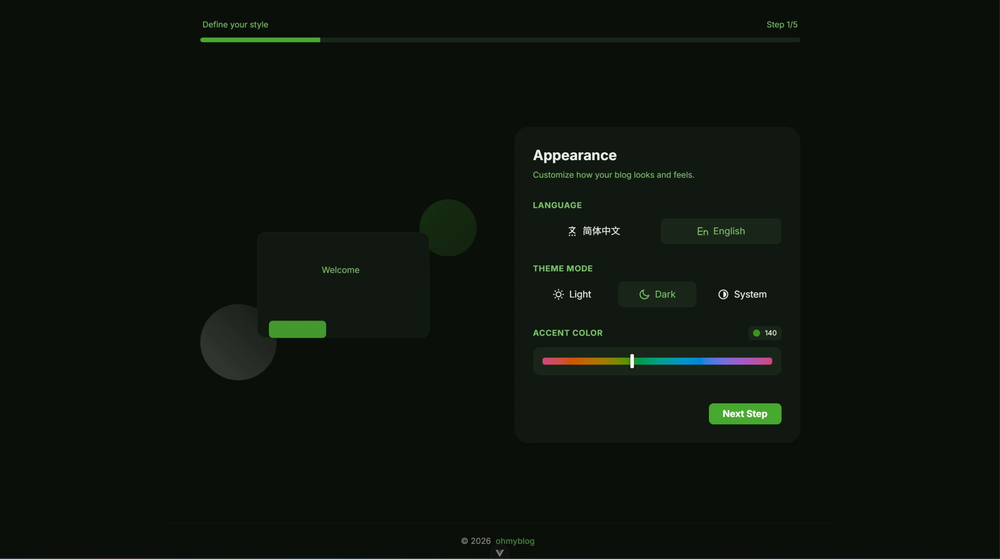
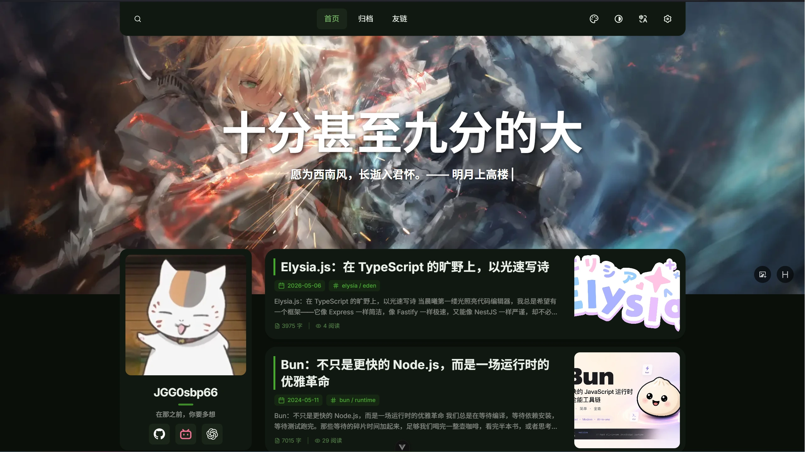
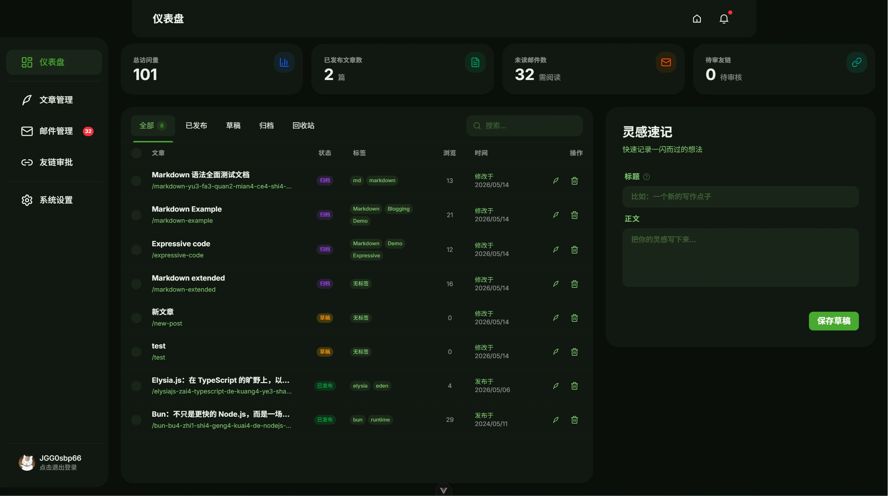
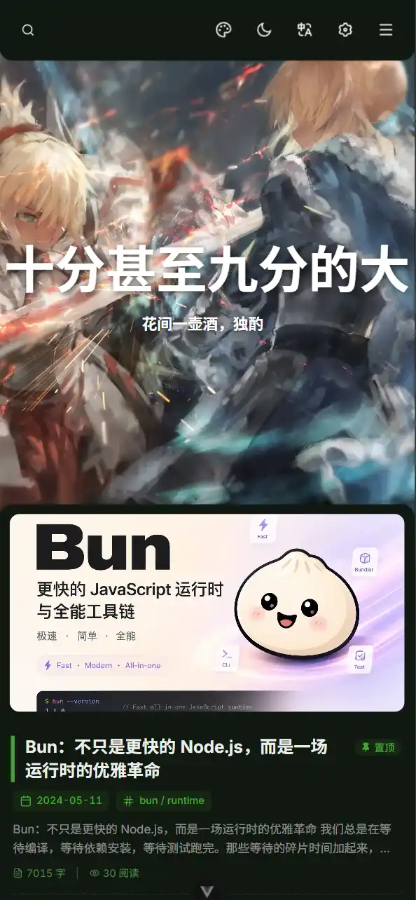
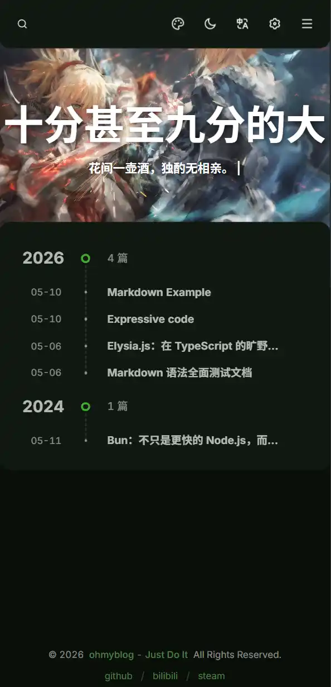
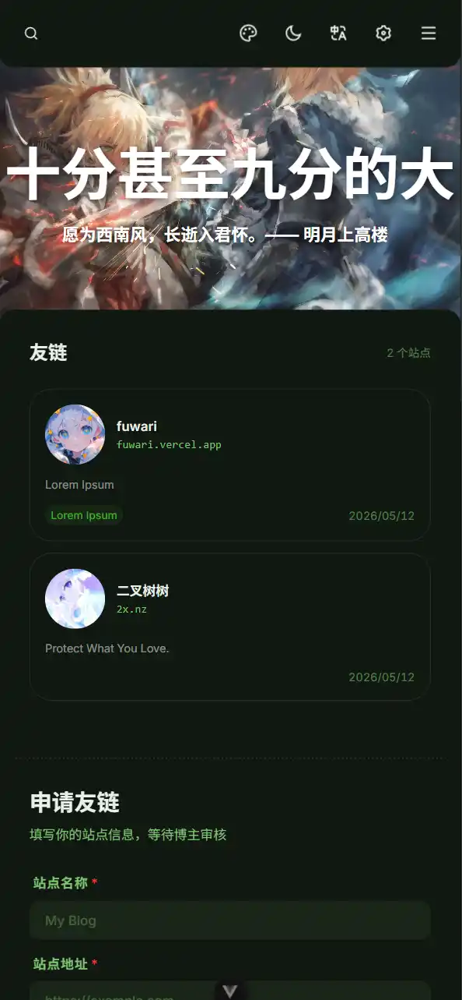

<div align="center">
	<h1>ohmyblog</h1>
	<p>一个现代化、可自部署的全栈博客系统（前台 + 管理后台 + API）。</p>
	<p>
		<a href="https://github.com/JGG0sbp66/ohmyblog/releases/latest"></a>
		<a href="https://github.com/JGG0sbp66/ohmyblog/pkgs/container/ohmyblog"></a>
		
	</p>
	<p>
		
		
		
		
	</p>
</div>

## 🖼️ 预览

### 桌面端

<p align="center">
	
</p>
<p align="center">
	
</p>
<p align="center">
	
</p>

### 📱 移动端

<div align="center">
  <table>
    <tr>
      <td width="33%"></td>
      <td width="33%"></td>
      <td width="33%"></td>
    </tr>
    <tr>
      <td align="center"><strong>首页</strong></td>
      <td align="center"><strong>归档页</strong></td>
      <td align="center"><strong>友链页</strong></td>
    </tr>
  </table>
</div>

## ✨ 功能特性

### 🎨 设计与界面

- [x] 主题模式：浅色 / 深色 / 跟随系统
- [x] 品牌色相自定义（Hue 0-360）
- [x] 多语言切换（zh-CN / en-US）
- [x] 响应式布局，移动端友好

### 🔍 内容与搜索

- [x] 前台文章列表分页 + 关键词搜索（标题 / 正文）
- [x] 归档时间轴数据接口（全量轻量列表）
- [x] 文章详情使用 Markdown 输出（contentMarkdown）
- [x] 标签与 slug 友好链接

### 📝 内容创作与管理

- [x] 草稿一键创建 + 编辑器自动保存
- [x] 标题自动生成 slug，支持手动覆盖
- [x] 状态流转：草稿 / 发布 / 归档 / 回收站
- [x] 管理后台文章列表分页 + 各状态统计
- [x] 摘要、封面图、行内图完整支持

### 🔗 友链生态

- [x] 前台友链展示 + 申请提交
- [x] 管理后台审核通过 / 拒绝 / 更新 / 删除
- [x] 待审核数量统计（仪表盘）

### 📧 邮件与账号

- [x] 登录 / 注册 / 登出 / 账号信息更新
- [x] 忘记密码验证码 + 重置密码
- [x] SMTP 配置、连接测试、发送测试邮件
- [x] 邮件日志列表、未读统计与预览

### ⚙️ 站点配置

- [x] 站点标题 / 图标 / 页脚 / 备案 / 页脚链接
- [x] 个人信息：头像 / 简介 / 社交链接
- [x] 首页 Hero 图与标题 / 副标题配置

### 🖼️ 资源与上传

- [x] 网站图标 / 管理员头像 / 社交图标上传
- [x] 首页横幅 / 文章封面 / 文章行内图上传
- [x] 上传后自动处理并返回可访问 URL

### 🛠 技术特性

- [x] Eden Treaty 前后端类型共享
- [x] OpenAPI 文档 + 健康检查
- [x] /api/uploads 静态资源访问

## 🧰 技术栈

- 前端：Vue 3、Vite、Tailwind CSS 4、Pinia、Vue Router、Vue I18n
- 后端：Bun、Elysia、Drizzle ORM、SQLite、Zod

## 🚀 快速开始

### 📦 安装依赖

```bash
# 后端
cd ohmyblog-backend
bun install

# 前端
cd ../ohmyblog-frontend
bun install
```

### ▶️ 启动开发

```bash
# 启动后端（默认 3000）
cd ohmyblog-backend
bun run dev

# 启动前端（默认 5173）
cd ../ohmyblog-frontend
bun run dev
```

### 🔗 访问地址

- 前台：<http://localhost:5173>
- OpenAPI：<http://localhost:3000/openapi>（仅开发环境）

### 🐳 Docker 部署

> 镜像会同时打包前后端，后端通过 Elysia 挂载前端静态文件。

**方式一：Docker Compose（推荐）**

仓库根目录已提供 `docker-compose.yml`，环境变量和数据卷都有详细注释：

```bash
docker compose up -d
```

访问 <http://localhost:3000> 即可打开前台页面，首次访问会自动进入 `/setup` 初始化向导。

**方式二：从 GitHub Container Registry 拉取**

```bash
docker run -d -p 3000:3000 -v ohmyblog-data:/app/data \
  ghcr.io/jgg0sbp66/ohmyblog:latest
```

> `-v` 不能省。所有数据（SQLite、上传的图片、自动生成的 `JWT_SECRET`）都在 `/app/data` 下，不挂卷的话容器一删就全没了。

**方式三：本地构建镜像**

```bash
cd ohmyblog-backend
bun run docker   # 使用 scripts/Dockerfile，build context 是仓库根目录
docker run -d -p 3000:3000 -v ohmyblog-data:/app/data ohmyblog
```

### 🎭 演示模式

设置 `DEMO_MODE=true` 可以把实例变成**只读演示站**：游客不用登录就能进 `/admin` 浏览完整后台（文章列表、编辑器、友链、邮件、设置），但所有写操作一律被拒绝。

```bash
docker run -d -p 3001:3000 -v ohmyblog-demo-data:/app/data \
  -e DEMO_MODE=true ghcr.io/jgg0sbp66/ohmyblog:latest
```

或用 compose 部署时，把 `docker-compose.yml` 里的 `DEMO_MODE` 改成 `"true"`。

跑独立二进制的话，改 `data/.env` 里的 `DEMO_MODE` 即可（只有字面量 `true` / `1` 会打开，其他值一律视为关闭）。

几点说明：

- **不影响初始化。** 系统还没有管理员时演示限制完全不生效，可以照常走完 `/setup` 向导；建出第一个管理员后自动切换为只读。
- **站长不受限。** 用真实账号登录后写操作全部恢复正常，演示横幅也会消失。
- **没有可窃取的凭证。** 游客拿到的虚拟管理员身份不会签发 JWT、不下发 cookie，只是每次请求在内存里算出来的，无法被伪造或重放；`DEMO_MODE` 关闭时这条分支根本不会执行。
- **仍会放行的写操作**：登录、登出，以及前台的友链申请（属于要演示的功能）。
- **SMTP 配置（含密码）对游客不可见**，但邮件日志里的收件人地址和正文可见——演示库请用假数据，不要拿正式库的副本。

## 🧱 项目结构

```text
ohmyblog/
├── img/                 # README 预览图
├── docker-compose.yml   # 部署编排
├── ohmyblog-backend/    # 后端 API 服务
└── ohmyblog-frontend/   # 前端 Web 应用
```

## 📚 文档

- [前端文档](./ohmyblog-frontend/README.md)
- [后端文档](./ohmyblog-backend/README.md)

## 📄 许可证

本项目基于 MIT 许可证，详见 [LICENSE](./LICENSE)。
